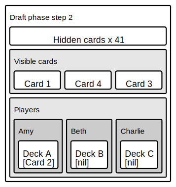

# Spin: The political card game

This project is an exercise in building our the back end of a politically-themed card game called 'Spin'.

'Spin' is a game for 2-6 players, each representing a political candidate in the run up to a general election. The aim of the game is to be the player with the highest total number of voters at the end of the final round. To help accomplish this goal, players can play various types of cards to attract voters, gain influence, and disrupt their opponents' plans.

The game is split into two distinct phases: The Draft phase and the Campaign phase.

## Draft phase
During the Draft phase, three randomly chosen cards are revealed, and each player takes turns selecting one card that they would like to add to their deck. Once a card is chosen, it is replaced by a new random card. The Draft phase is over once all of the cards are depleted, and each player has built their own personal deck using the cards that they have chosen.

     

In the example above, Amy Beth and Charlie have just started playing. Amy goes first, looks at the cards on display (Card1, Card2 and Card3), and decides to choose Card2 to play with. Card2 becomes the first card in her deck, and a new card from the pile (Card4) is turned over to replace it. Then it is Beth's turn to choose either Card1, Card4 or Card3, followed by Charlie, and then back around to Amy. The draft repeats in this manner until all of the cards are gone, and each player should have built their own deck of 15 cards that they selected.

## Campaign phase
The Campaign phase is where the bulk of the gameplay takes place.

Players each draw a hand of five cards from their respective decks, and can then play up to three cards from their hand before drawing from their deck until they have five cards again. Then they pass the turn to the player on their left. At the start of the game there is a central pool of 'undecided' voters that players can sway to their side using card effects. Once this pool is depleted, players can steal voters directly from their opponents as the campaign race heats up. When the voter pool is empty, if a player starts their turn with the highest number of voters they are considered to be in 'Pole Position'. If they can maintain this position until the start of their next turn (i.e. they still have the most voters), they win the game.

Game Concept and Rules (C) David Reeson, 2019
