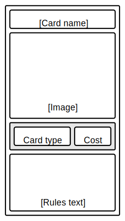

# Card types

## Pledge
Pledges are cards that generally confer a positive benefit to the person who plays them (e.g. gain 3 voters). Some pledges require another target player to be specified when played. After a pledge is played and its effect resolves, it is returned to the bottom of its owner's deck unless the card states otherwise.

## Smear
Smears are cards that generally confer a negative effect to an opponent (e.g. lose all influence). Most smears require another target player to be specified when played. After a smear is played and its effect resolves, it is returned to the bottom of its owner's deck unless the card states otherwise.

## Advisor
Advisor cards have effects similar to pledges and smears, but instead of only triggering once, they stay on the field and continue to trigger their effect at the start of each subsequent turn. After an advisor is played an its effect triggers it is placed in the Advisors zone in front of the player who owns it(unless otherwise stated on the card). There is no limit on the number of advisors a player can have. At the start of a player's turn the effects of all of the advisors in their advisor zone trigger once each. If a player owns multiple advisors they can chose the order in which their effects activate. An advisor remains in play indefinitely unless it is removed by another card effect, at which point it goes to the bottom of its owner's deck.

## Rumour
Rumour cards do not belong to the main card library and as such are not present in the draft phase. They are instead created by the effects of other cards during the campaign phase. Rumours have no effect when played, and exist mainly to take up space in a player's hand and make them spend time/resources to get rid of them (although some cards are designed to interact with rumours in more interesting ways). There is no limit to the number of rumours that may be active in a game at any given time. Once a rumour is played it is destroyed and removed from its owner's deck.

# Influence
Influence is a game currency representing a player's political resources. All players begin the game with 0 influence, but may obtain more through card effects. Some cards with more powerful effects have an influence cost that must be paid each time it is used. Influence does not deplete between turns, and can only be removed by paying for a card with an influence cost, or by other card effects (e.g. being targeted by an opponent's smear).

# Voters
Voters are the primary resource use to determine the winner at the end of the game. Voters can exist in one of three states:

## Undecided voters
At the beginning of the game, all voters exist in an 'undecided' state without allegiance or association with any particular player. If a card effect causes a player to gain any number of voters, they are taken from this undecided group.

## Decided voters
If a player uses a card effect to gain voters, they are added to that player's voter pool. The player with the most voters in their pool at the end of the game is declared the winner. If a player would gain voters while there are no more undecided voters left, they may steal voters directly from another player instead.

## Locked voters
Some card effects may allow a player to 'lock' voters that are already in their personal voter pool. Locked voters cannot be stolen or returned to the undecided voters pool. They are still counted as part of that player's voter pool.
